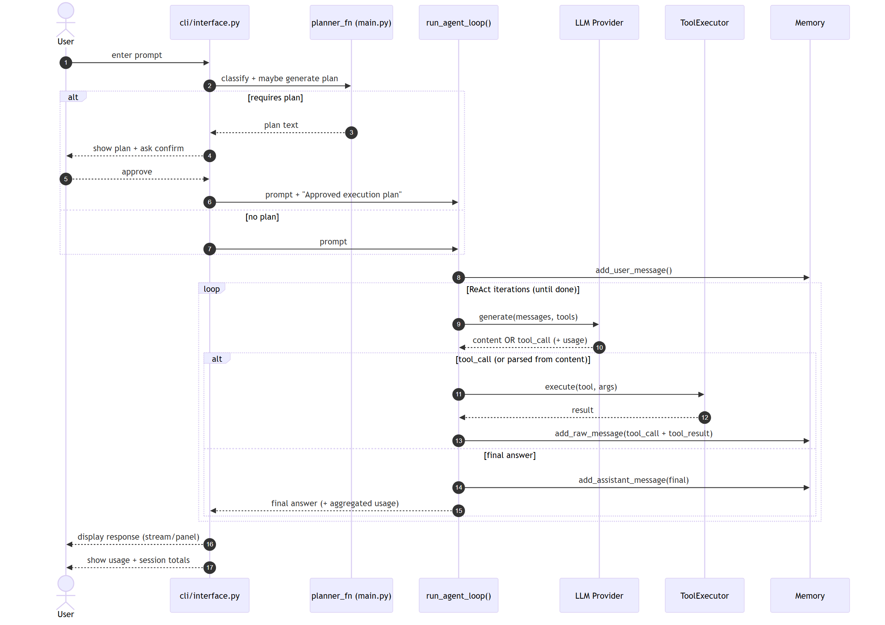

# Vertex

[](https://github.com/rahulrb99/ai-coding-assistant/actions/workflows/tests.yml)
[](LICENSE)

**CLI AI coding assistant** — a ReAct agent that reads and edits your repo, runs shell commands, searches the web, and retrieves docs via MCP. Not a chatbot: it plans, calls tools, and iterates until the task is done.

```
> create a Streamlit sentiment analyser
> fix the bug in @app.py
> search the web for the latest LangChain release
```

## Demo

[Watch the 10-minute walkthrough](https://drive.google.com/file/d/1HKXA25rdEU3YZ1KBbMusNClehQ0LgDTz/view?usp=sharing) — Plan Mode, file edits, MCP tools, and HyDE RAG.

The Drive file must be **Anyone with the link can view**.

## What it does

| Capability | How |
|---|---|
| Agentic loop | ReAct, up to 10 tool-calling iterations per task |
| Plan Mode | For multi-step repo changes: classify → short plan → you approve (one re-plan if you reject) |
| Local tools | `read_file`, `write_file`, `edit_file`, `run_shell`, `search_codebase` (ripgrep or regex) |
| Safety | Workspace path sandbox; Safe Mode confirms before write/shell |
| Providers | Groq, OpenAI, or Ollama (local), same agent loop |
| MCP | Filesystem, Tavily web search, custom LangChain-docs RAG (HyDE + Chroma) |
| Session memory | Sliding window, persisted across restarts |
| `@file` mentions | `fix @app.py` injects the file into the prompt |
| Usage | Prompt + completion tokens after each response |

MCP servers are **best-effort**: if Node/`npx` or an API key is missing, Vertex still runs on local tools.

## Architecture

```
User  →  CLI (Rich REPL, streaming)
           →  Plan Mode (optional approval)
           →  Agent loop (ReAct)
                 →  Provider (Groq / OpenAI / Ollama)
                 →  Tool executor  →  local tools
                                  →  MCP tools (filesystem, Tavily, RAG)
                 →  Memory (truncated history)
```

The agent loop **never** executes file or shell operations itself. It only decides the next tool call; `ToolExecutor` validates schema, keeps paths inside `WORKSPACE_ROOT`, and applies Safe Mode.

Docs RAG is an **on-demand tool**, not stuffed into every prompt. HyDE generates a hypothetical answer, embeds it with MiniLM, and retrieves from Chroma.



## Quick start

**Requirements:** Python 3.10–3.13, a Groq or OpenAI key (or Ollama). Node.js 18+ and `npx` only if you want MCP filesystem / Tavily.

```bash
git clone https://github.com/rahulrb99/ai-coding-assistant.git
cd ai-coding-assistant
python -m venv .venv
# Windows: .venv\Scripts\activate
# macOS/Linux: source .venv/bin/activate
pip install -r requirements.txt
cp .env.example .env
```

Edit `.env`:

```env
MODEL_PROVIDER=groq
MODEL_NAME=llama-3.3-70b-versatile
GROQ_API_KEY=your_key
TAVILY_API_KEY=          # optional, web search
WORKSPACE_ROOT=.
```

Free Groq key: [console.groq.com](https://console.groq.com). Free Tavily key: [tavily.com](https://tavily.com).

```bash
python main.py
```

On first launch, pick **safe** (confirm writes/shell) or **auto**, and which provider to use. Preference is saved.

### Ollama (no API key)

```bash
ollama pull llama3.2
ollama serve
```

```env
MODEL_PROVIDER=ollama
MODEL_NAME=llama3.2
```

Tool calling needs Llama 3.1+ class models. Local models often emit messy tool-call text; Vertex has fallback parsers for that.

### Optional: custom RAG (LangChain docs)

```bash
python custom_rag_server/download_docs.py
```

The MCP client starts `custom_rag_server/main.py` itself. Indexing is lazy so the server does not block startup.

## Usage

```
> create a streamlit sentiment analyser app
> fix the bug in @app.py
> add error handling to @tools/run_shell.py
> what is the time complexity of quicksort?
> search the web for the latest LangChain release
```

| Command | Action |
|---|---|
| `/help` | Commands and loaded tools |
| `/usage` or `/stats` | Session token totals |
| `/clear` | Clear conversation memory |
| `set mode safe` / `set mode auto` | Confirmation vs autonomous tools |
| `set provider groq` | Switch provider this session |
| `exit` / `quit` | Leave |

## Project layout

```
main.py                    # CLI entry — wires loop, tools, MCP, Plan Mode
agent/                     # ReAct loop, memory, prompt builder
cli/                       # Rich REPL, streaming, Plan Mode UX
config/                    # .env settings
providers/                 # Groq, OpenAI, Ollama (normalized function calling)
tools/                     # Registry, executor, file/shell/search tools
mcp/                       # MCP client (stdio / SSE, best-effort load)
custom_rag_server/         # HyDE + Chroma MCP server
diagrams/                  # Sequence and state diagrams
tests/                     # Unit tests for agent loop, CLI, tools, Safe Mode
docs/design/               # Architecture notes and team reflection
```

Design notes and the original interface contracts live in [`docs/design/`](docs/design/).

## Tests

```bash
pip install -r requirements-dev.txt
pytest tests/ -v
```

CI runs the same **44 tests** on Python 3.11 and 3.12. Tests use mocks for the LLM and cover the agent loop, CLI, settings, workspace path sandbox, and Safe Mode. They do not call live APIs.

## Team

Five-person team. Interfaces were frozen first so work could proceed in parallel.

| Person | Owned |
|---|---|
| **Rahul** | Integration, ReAct loop, CLI/streaming, Plan Mode, MCP wiring, robustness |
| Dhruti | Tool interface, executor, Safe Mode, local file/shell tools |
| Maya | Provider abstraction (Groq / OpenAI / Ollama) |
| Thanmay | MCP client and server integration |
| Mike | Memory, prompt builder, custom RAG server (HyDE + Chroma) |

## Troubleshooting

**`ModuleNotFoundError: mcp`** — `pip install -r requirements.txt`

**`npx: command not found`** — install [Node.js 18+](https://nodejs.org). Vertex still runs without MCP.

**Groq 429** — free tier is rate-limited. Switch provider or wait.

**Agent repeating tools** — the loop stops after 10 iterations. Rephrase the task.

**Windows console** — output avoids fancy Unicode so cp1252 terminals do not crash.

## License

[MIT](LICENSE)
